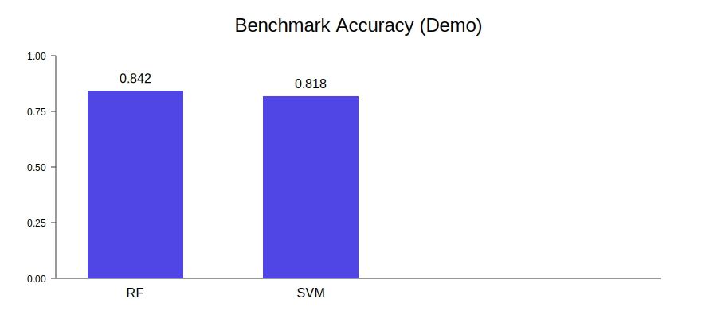
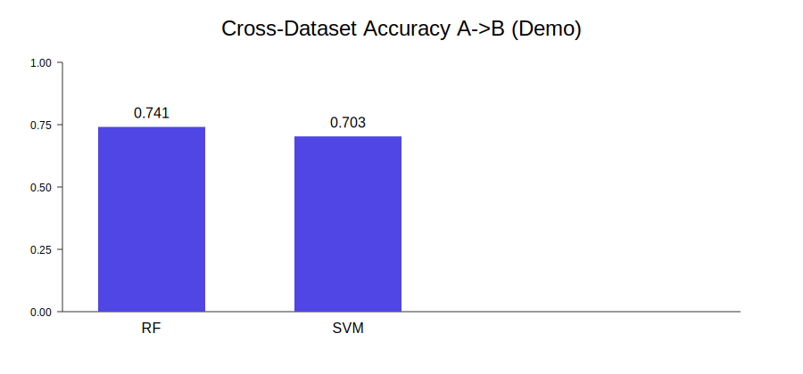
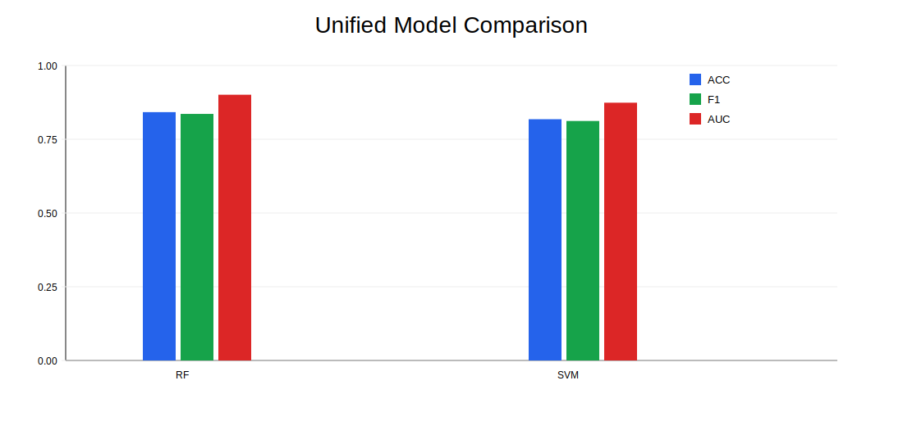
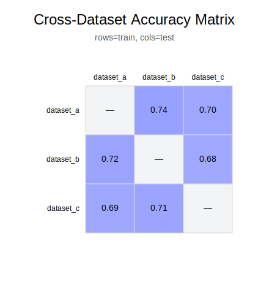

# BCI MVP (Low-Hardware Personal Project)

A lightweight brain-computer interface MVP focused on EEG preprocessing, state classification (relaxed vs focused), API serving, and interactive visualization.

## Features
- EDF EEG loading and preprocessing (MNE)
- Band-power feature extraction (delta/theta/alpha/beta)
- RandomForest baseline with CV + test metrics
- FastAPI inference service
- Streamlit dashboard demo

## Project Structure
```text
bci-mvp/
  src/                # preprocessing, training, inference, data checks
  api/                # FastAPI app
  app/                # Streamlit app
  data/relaxed/       # place relaxed EDF files
  data/focused/       # place focused EDF files
  outputs/            # model + metrics
```

## Quick Start
```bash
python -m venv .venv
source .venv/bin/activate
pip install -r requirements.txt

python src/check_data.py
python src/train.py

uvicorn api.main:app --reload --port 8000
streamlit run app/dashboard.py
```

## Data Notes
Use public datasets such as:
- PhysioNet EEGMMI
- BCI Competition IV
- Sleep-EDF (for signal pipeline validation)

## Publish Plan
- Code: GitHub
- Live demo: Hugging Face Spaces (Streamlit)
- Video demo: Bilibili / YouTube
- Community posts: Reddit / Zhihu


## Impressive Upgrades (In Progress)
- ✅ Multi-model benchmarking (`src/benchmark.py`)
- ✅ Simulated real-time streaming demo (`app/streaming_demo.py`)
- ⏳ Cross-dataset evaluation
- ⏳ Explainability (SHAP)
- ⏳ Hugging Face Spaces deployment

## Benchmark Run
```bash
python src/benchmark.py
```

## Streaming Demo Run
```bash
streamlit run app/streaming_demo.py
```


## Cross-Dataset Evaluation (Train A -> Test B)
```bash
python src/cross_dataset_eval.py --train dataset_a --test dataset_b
```
Expected layout:
```text
data/
  dataset_a/{relaxed,focused}/*.edf
  dataset_b/{relaxed,focused}/*.edf
```
Results are saved to `outputs/cross_dataset_results.json`.

## Hugging Face Spaces (Public Demo)
- App file: `app/hf_app.py`
- Deployment notes: `app/README_SPACES.md`


## Explainability
```bash
python src/explainability.py
```
Generates:
- `outputs/feature_importance_detailed.csv`
- `outputs/feature_importance_by_band.csv`
- `outputs/feature_importance_by_channel.csv`

## Reproducibility & Engineering
- Dockerized API service (`Dockerfile`)
- CI checks (`.github/workflows/ci.yml`)
- Makefile commands for consistent local runs


## Publication-Ready Visuals
Generate benchmark figures for README/posts:
```bash
python src/plot_results.py
```
Outputs:
- `outputs/benchmark_scores.png`
- `outputs/cross_dataset_scores.png` (if cross-dataset json exists)


## Result Figures

### Benchmark Comparison


### Cross-Dataset Generalization (Train A -> Test B)


> Note: current figures are demo placeholders. Replace with real experiment outputs after running full evaluations.


## Model-Agnostic Explainability (Permutation Importance)
```bash
python src/permutation_explain.py
```
Outputs:
- `outputs/permutation_importance_detailed.csv`
- `outputs/permutation_importance_by_band.csv`
- `outputs/permutation_importance_by_channel.csv`
- `outputs/permutation_importance_summary.json`


<!-- LATEST_PROGRESS_START -->
## Latest Progress
- 2026-03-22 14:47:47 UTC — Integrated risk governance into release readiness scoring
- Full log: `logs/progress.md`
<!-- LATEST_PROGRESS_END -->


## Streaming Stability Upgrade
Added `src/streaming.py`:
- EMA smoothing for focused probability
- Hysteresis thresholds for stable state transitions

This reduces flicker in real-time prediction UIs.


## Stronger Nonlinear Baseline
Added `src/deep_baseline.py` (MLP baseline) and `src/merge_results.py` to combine classical + deep results.

Run:
```bash
python src/deep_baseline.py
python src/merge_results.py
```


### Unified Model Comparison


Generate it with:
```bash
python src/merge_results.py
python src/plot_all_models.py
```


## Cross-Dataset Matrix Evaluation
For multiple datasets, run all train→test pairs:
```bash
python src/cross_dataset_matrix.py
```
Output: `outputs/cross_dataset_matrix.json`


### Cross-Dataset Matrix Heatmap


Generate:
```bash
python src/cross_dataset_matrix.py
python src/plot_cross_matrix.py
```


## Release Pack (Auto-generated)
Generate platform-ready announcement drafts:
```bash
python src/generate_release_pack.py
```
Outputs:
- `docs/release/release_en.md`
- `docs/release/release_zh.md`
- `docs/release/reddit_post.md`
- `docs/release/bilibili_post.md`


## Model Card & HF Space Metadata
Generate public-facing model docs:
```bash
python src/generate_model_card.py
```
Outputs:
- `docs/MODEL_CARD.md`
- `docs/HF_SPACE_README.md`


## Artifact Validation (Repro Readiness)
Run a quick consistency check before public release:
```bash
python src/validate_artifacts.py
```
Output:
- `outputs/artifact_validation_report.txt`


## One-Command Full Pipeline
Run the full reproducible workflow and generate a run manifest:
```bash
python src/run_full_pipeline.py
# or
make full
```
Output:
- `outputs/pipeline_manifest.json`


## Probability Calibration
Evaluate reliability of predicted probabilities:
```bash
python src/calibration_eval.py
python src/plot_calibration.py
```
Outputs:
- `outputs/calibration_results.json`
- `assets/calibration_curve.svg`


## Robustness Evaluation
Stress-test model under synthetic perturbations (noise/dropout):
```bash
python src/robustness_eval.py
python src/plot_robustness.py
```
Outputs:
- `outputs/robustness_results.json`
- `assets/robustness_accuracy.svg`


## Release Readiness Dashboard
Generate release readiness checklist:
```bash
python src/release_readiness.py
```
Output:
- `docs/RELEASE_READINESS.md`


## HF Space Readiness Check
```bash
python src/hf_space_readiness.py
```
Output:
- `docs/HF_SPACE_READINESS.md`


## Model Leaderboard
Generate ranked comparison table:
```bash
python src/leaderboard.py
```
Output:
- `docs/MODEL_LEADERBOARD.md`


## Auto Changelog
Generate changelog from recent git commits:
```bash
python src/changelog_from_git.py
```
Output:
- `docs/CHANGELOG_AUTO.md`


## Ablation Study
Quantify contribution of each EEG band by zeroing it out:
```bash
python src/ablation_eval.py
python src/plot_ablation.py
```
Outputs:
- `outputs/ablation_results.json`
- `assets/ablation_accuracy.svg`


## Figure Gallery
Generate a browsable gallery of all visual artifacts:
```bash
python src/generate_figure_gallery.py
```
Output:
- `docs/FIGURE_GALLERY.md`


## Docs Bundle Index
Generate a single navigation page for all major docs:
```bash
python src/update_docs_bundle.py
```
Output:
- `docs/DOCS_BUNDLE_INDEX.md`


## Status Badges (Local)


Refresh badges:
```bash
python src/generate_status_badges.py
```


## Command Center
Generate a single command reference page:
```bash
python src/command_center.py
```
Output:
- `docs/COMMAND_CENTER.md`


## Risk Register
Generate technical risk and mitigation table:
```bash
python src/risk_register.py
```
Output:
- `docs/RISK_REGISTER.md`


## Final Release Candidate
Generate one-shot release bundle summary:
```bash
python src/final_release_candidate.py
```
Output:
- `docs/FINAL_RELEASE_CANDIDATE.md`

- Release readiness now includes risk-register coverage (`docs/RISK_REGISTER.md`).
