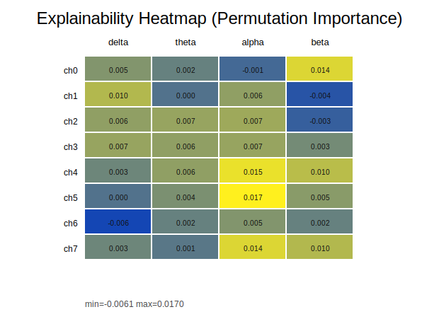
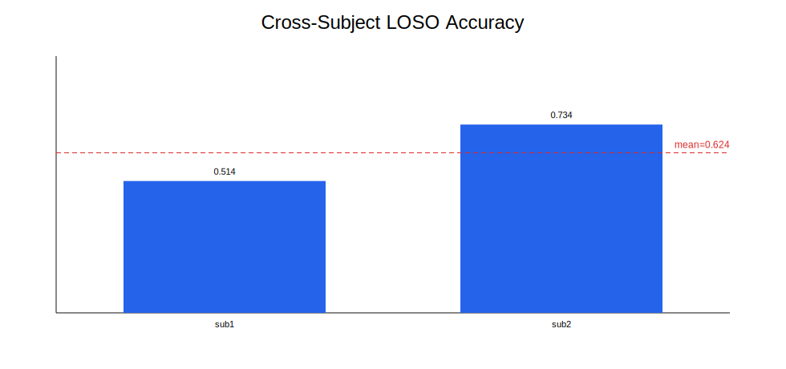

# BCI MVP Technical Report

Generated: 2026-03-22 21:55 UTC

## 1) Benchmark Summary

| Model | Accuracy | F1 | AUC |
|---|---:|---:|---:|
| SVM | 0.8435374149659864 | 0.8855721393034826 | 0.8928872053872055 |
| RF | 0.8231292517006803 | 0.8773584905660378 | 0.8470117845117845 |

## 2) Unified Model Table

| Model | Accuracy | F1 | AUC |
|---|---:|---:|---:|
| SVM | 0.8435374149659864 | 0.8855721393034826 | 0.8928872053872055 |
| RF | 0.8231292517006803 | 0.8773584905660378 | 0.8470117845117845 |

## 3) Cross-Dataset Generalization

- Train dataset: **dataset_a**
- Test dataset: **dataset_b**
- Train samples: 1200
- Test samples: 900

| Model | Accuracy | F1 | AUC |
|---|---:|---:|---:|
| RF | 0.741 | 0.732 | 0.801 |
| SVM | 0.703 | 0.695 | 0.766 |

## 4) Explainability Summary

- Base test accuracy: 0.8231292517006803
- Num features: 32
- Top band: [{'band': 'alpha', 'importance_mean': 0.0693877551020409}]
- Top channel: [{'channel': 4, 'importance_mean': 0.03401360544217691}]

- 
- Validation: `docs/EXPLAINABILITY_VALIDATION.md`

## 5) Probability Calibration

- Brier score: 0.1400096513605442
- Bins: 10

## 6) Robustness under Perturbations

| Setting | Accuracy | F1 |
|---|---:|---:|
| clean | 0.8231292517006803 | 0.8773584905660378 |
| noise_0.05 | 0.6802721088435374 | 0.8081632653061225 |
| noise_0.10 | 0.6802721088435374 | 0.8081632653061225 |
| dropout_0.05 | 0.8231292517006803 | 0.8773584905660378 |
| dropout_0.10 | 0.8231292517006803 | 0.8773584905660378 |
| mixed | 0.673469387755102 | 0.8032786885245902 |

## 7) Cross-Subject Generalization (LOSO)

- Subjects: [1, 2]
- Mean Accuracy: 0.6235517200191113
- Mean F1: 0.6662368543622681
- Mean AUC: 0.6873526463070685

### Cross-Subject Model Benchmark

| Model | Mean Accuracy | Mean F1 | Mean AUC |
|---|---:|---:|---:|
| rf | 0.6235517200191113 | 0.6662368543622681 | 0.6873526463070685 |
| logreg | 0.4458910654562828 | 0.31176544136034007 | 0.6611930966860567 |
| svm_rbf | 0.34976708074534163 | 0.11177944862155388 | 0.5805377445795875 |

### Cross-Subject Significance

- `docs/CROSS_SUBJECT_SIGNIFICANCE.md`

## 8) Visual Artifacts

- 
- 
- 
- 
- 

## 10) Release Readiness

- Pipeline status: `docs/PIPELINE_STATUS.md`
- Artifact validation: `outputs/artifact_validation_report.txt`
- Model card: `docs/MODEL_CARD.md`
